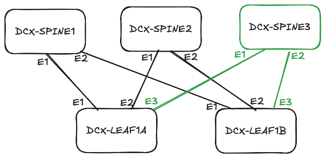

# Network Immutability

This project was created to support my post "The Case for Immutable Network Configuration".
This project is extremely limitted as support material for this post and it does not in anyway try to represent a correct configuration scenario.


Existing scenario is depicted in black and new spine and connections is depicted in green.
The following branches exist:
* main: Represents the existing network scenario.
* adding-leaf-switch: Represents the network after adding a new leaf switch.
* adding-spine-switch: Represents the network after adding a new spine switch.

## How to use

If you want to follow alone the post, use the main branch to simulate a network in the current state.
Use the branch `adding-leaf-switch` to see how a network is modified when a new leaf switch is added.
Use the branch `adding-spine-switch` to see how a network is modified when a new spine switch is added.

1. Run the commands in the section "How to compare".
2. Change the branch to the desired state (e.g., `adding-leaf-switch` or `adding-spine-switch`).

## Expectation

The network expectation is that when a new switch is added we dont need to reconfigure existing switches.
For example adding a new leaf switch should not modify any existing leaf switches, as proven by the diff command `git diff main adding-leaf-switch -- intended/configs/DCX-LEAF1B.cfg`.
But adding a new spine require reconfiguring existing leaf switches, as proven by the diff command `git diff main adding-spine-switch -- intended/configs/DCX-LEAF1B.cfg`.

```bash
diff --git a/intended/configs/DCX-LEAF1B.cfg b/intended/configs/DCX-LEAF1B.cfg
index c1ffb3b..14f8ee2 100644
--- a/intended/configs/DCX-LEAF1B.cfg
+++ b/intended/configs/DCX-LEAF1B.cfg
@@ -111,14 +111,21 @@ interface Ethernet1
    no shutdown
    mtu 1600
    no switchport
-   ip address 10.255.255.5/31
+   ip address 10.255.255.7/31
 !
 interface Ethernet2
    description P2P_DCX-SPINE2_Ethernet2
    no shutdown
    mtu 1600
    no switchport
-   ip address 10.255.255.7/31
+   ip address 10.255.255.9/31
+!
+interface Ethernet3
+   description P2P_DCX-SPINE3_Ethernet2
+   no shutdown
+   mtu 1600
+   no switchport
+   ip address 10.255.255.11/31
 !
 interface Ethernet4
    description MLAG_DCX-LEAF1A_Ethernet4
@@ -402,14 +409,20 @@ router bgp 65101
    neighbor 10.255.0.2 peer group EVPN-OVERLAY-PEERS
    neighbor 10.255.0.2 remote-as 65100
    neighbor 10.255.0.2 description DCX-SPINE2_Loopback0
+   neighbor 10.255.0.3 peer group EVPN-OVERLAY-PEERS
+   neighbor 10.255.0.3 remote-as 65100
+   neighbor 10.255.0.3 description DCX-SPINE3_Loopback0
    neighbor 10.255.1.96 peer group MLAG-IPv4-UNDERLAY-PEER
    neighbor 10.255.1.96 description DCX-LEAF1A_Vlan4093
-   neighbor 10.255.255.4 peer group IPv4-UNDERLAY-PEERS
-   neighbor 10.255.255.4 remote-as 65100
-   neighbor 10.255.255.4 description DCX-SPINE1_Ethernet2
    neighbor 10.255.255.6 peer group IPv4-UNDERLAY-PEERS
    neighbor 10.255.255.6 remote-as 65100
-   neighbor 10.255.255.6 description DCX-SPINE2_Ethernet2
+   neighbor 10.255.255.6 description DCX-SPINE1_Ethernet2
+   neighbor 10.255.255.8 peer group IPv4-UNDERLAY-PEERS
+   neighbor 10.255.255.8 remote-as 65100
+   neighbor 10.255.255.8 description DCX-SPINE2_Ethernet2
+   neighbor 10.255.255.10 peer group IPv4-UNDERLAY-PEERS
+   neighbor 10.255.255.10 remote-as 65100
+   neighbor 10.255.255.10 description DCX-SPINE3_Ethernet2
    redistribute connected route-map RM-CONN-2-BGP
    !
    vlan 11
```
**NOTE:** In this case uplink interfaces Ethernet1 and Ethernet2 get a new IP, and two old BGP neighbors are upddated. There are on top of this the expected changes.

## How to compare

Check the diff between the branches, while in the main branch use:

```bash
git diff adding-leaf-switch -- intended/configs/DCX-LEAF1B.cfg
git diff adding-leaf-switch -- intended/configs/DCX-SPINE1.cfg
git diff adding-spine-switch -- intended/configs/DCX-LEAF1B.cfg
git diff adding-spine-switch -- intended/configs/DCX-SPINE1.cfg

## Prerequisites

1. Clone the repository
1. Create a virtual environment:
   ```bash
   python -m venv venv
   source venv/bin/activate
   ```
2. Install the required packages:

   ```bash
   pip install -r requirements.txt
   ansible-galaxy collection install -r requirements.yml
   ```
3. Run the example playbook:

   ```bash
   ansible-playbook playbook.yml -i inventory.yml
   ```

